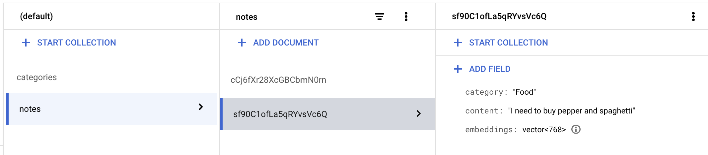

# Notes App Services

This repo includes a simplified version of the services behind the notes-app I've developed and that you can find in  [my personal blog](https://www.willstechtrunk.com/post/test-entrada-2). It contains the following: 

1. **compute-embeddings-function**, an example of a cloud function that  gets triggered every time  a document gets added in a firestore collecrtion to compute embeddings, categorize the content  and save them back in firestore. 

2. **expand-context**: Langserve Cloud Run example service. It exposes a Langchain Agent using Gemini as LLM to call three tools/functions: Google Places, Google Search and Summary Tool. 

3. **retrieve-notes**: LangServe Cloud Run example service that exposes a RAG Langchain chain that retrieves information in a firestore collection through Gemini. 


## Prerequisites

- A **Google Cloud Project** with a billing account associated.

- A shell environment with gcloud and git. Google Cloud Shell contains all the necessary tools. 

## Set up

Authorize to Google Cloud SDK using
```
gcloud auth login
```
Set your Google Cloud Project ID and region
```
PROJECT_ID=<your project id> 
REGION = <your region> # select a region where Gemini is available, for instance europe-west4 or us-central1  

gcloud config set project $PROJECT_ID
``````

Clone the repository

```
git clone https://github.com/willypalacin/notes-app
```

Enable the following services
```
gcloud services enable \
  firestore.googleapis.com \
  run.googleapis.com \
  aiplatform.googleapis.com \
  artifactregistry.googleapis.com \
  compute.googleapis.com \
  eventarc.googleapis.com \
  vpcaccess.googleapis.com \
  cloudfunctions.googleapis.com\
  cloudbuild.googleapis.com
  ```

  Define the following variables:


### Compute embbedings based on a firestore event
Please note that vector search in Firestore is in preview so the following code may change in the future. 

  Create the firestore database using the UI or the following gcloud comand

  ```
  gcloud firestore databases create --database='(default)' --location=REGION --type=firestore-native 
  ```
  Go to the embeddings function code

  ```
  cd compute-embeddings-function/
  ```
Deploy the function 
```
gcloud functions deploy compute-embeddings-function \
  gcloud functions deploy compute-embeddings-function   
  --gen2 \   
  --region=$REGION \  
  --runtime=python310 \   
  --source=.  \
  --entry-point=main \  
  --trigger-event-filters="type=google.cloud.firestore.document.v1.created" --trigger-event-filters="database=(default)"
```

Now that we have our funtion created lets adds some data do see how it computes the embeddings. Since we are going to use python for testing purposes we need to install the following sdk

```
pip install google-cloud-firestore
```

Lets open python in the shell

```
python3
```

```python
from google.cloud import firestore
db = firestore.Client(project='<PROJECT_ID>') # replace by your project ID
# We are going to create a categories collection with some categories
 db.collection("categories").document().set({"name": "Birthdays"})
  db.collection("categories").document().set({"name": "Food"})
  db.collection("categories").document().set({"name": "Random"})

  # Now that we have the categories created we can create a notes collection and add the content

  db.collection("notes").document().set({"content": "Julius birthday is 14 November"})
  db.collection("notes").document().set({"content": "I need to buy pepper and spagetthi"})
  exit()
```
As we will use semantic search we need to create a special type of index that accepts vector in the notes collection with the following command

```
gcloud alpha firestore indexes composite create --project=$PROJECT_ID --collection-group=notes --query-scope=COLLECTION --field-config=vector-config='{"dimension":"768","flat": "{}"}',field-path=embeddings
```

If we go to the Google cloud console UI we should see how the embeding field has been automatically created and the category




### Retrieval Augmented Generation using firestore

Once we have some data with embeddings we can perform semantic searches. Let's move to the retrieve notes directory

```
cd ../retrieve-notes
```

Once we create a langserve app it automatically creates a server.py and we can add the dependencies needed in the .toml file through poetry. If you want to learn how to deploy a langserve app from scratch you can have the full guide here. 

In this case, we have everything configured so we just need to deploy to Cloud Run. 

You can optionally set the Lanchain API Key to view traces of the app. To obtain the LangChain API key and view the LangChain trace, visit the [LangChain documentation](https://python.langchain.com/docs/get_started/quickstart/#langsmith).

```
LANGCHAIN_API_KEY=<> # Your Langchain APi Key
```

```
gcloud run deploy retrieve-notes --source . --set-env-vars LANGCHAIN_TRACING_V2=true,LANGCHAIN_API_KEY=$LANGCHAIN_API_KEY,PROJECT_ID=$PROJECT_ID,COLLECTION=notes,EMBEDDING_FIELD=embeddings --allow-unauthenticated --region $REGION
```

Once the Cloud Run langserve service has been deployed we can test our langchain directly from an HTTP endpoint

```
curl -X POST "https://<CLOUD_RUN_URL>/retrieve-notes/invoke"      -H "Content-Type: application/json"      -d '{"input":"What food i have to buy?"}'


{"output":"I need to buy pepper and spaghetti. (...)" 
```


### Langchain Agent endpoint connected with external tools
Following the last example we can also conect LangChain agent to external tools. In this example we won't be using the Firestore Database. 

To set this service we will need to obtain the 
1. Google Places API Key https://developers.google.com/maps/documentation/places/web-service/get-api-key

2. Google Custom Search API key. https://developers.google.com/custom-search/v1/introduction

Let's move to the expand-context directory

```
cd ../expand-context
```

```
GPLACES_API_KEY=<> # Replace with your API Key
GOOGLE_CSE_ID=<> # Replace with your API Key
GOOGLE_API_KEY=<> # Replace with your API Key
```

```
gcloud run deploy expand-context --source . --set-env-vars LANGCHAIN_TRACING_V2=true,LANGCHAIN_API_KEY=$LANGCHAIN_API_KEY,GPLACES_API_KEY=$GPLACES_API_KEY,GOOGLE_CSE_ID=$GOOGLE_CSE_ID,GOOGLE_API_KEY=$GOOGLE_API_KEY,PROJECT_ID=$PROJECT_ID,REGION=$REGION, --allow-unauthenticated --region $REGION
```

We can test the endpoint, 

```

curl -X POST "https://<CLOUD_RUN_URL>/expand-context/invoke" \
     -H "Content-Type: application/json" \
     -d '{"input":{"input":"Italian Restaurants near Ponzano street in Madrid"}}'
```
